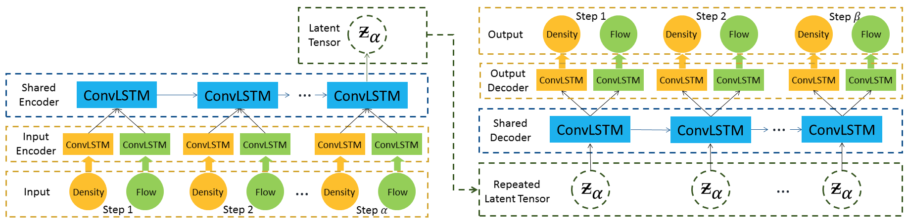

# KDD 2019 Paper
## DeepUrbanEvent: A System for Predicting Citywide Crowd Dynamics at Big Events

<p align="center"></p>

Source code for paper [DeepUrbanEvent: A System for Predicting Citywide Crowd Dynamics at Big Events](http://delivery.acm.org/10.1145/3340000/3330654/p2114-jiang.pdf?ip=150.82.219.15&id=3330654&acc=ACTIVE%20SERVICE&key=1B336DE9D4FBE3B9%2E1B336DE9D4FBE3B9%2E4D4702B0C3E38B35%2E4D4702B0C3E38B35&__acm__=1576632401_e0bf0a5200ee661038befcc1d0b090bf)

If you find that anything in this repository is useful to your own work, e.g. our proposed model/baselines/preprocessing, please cite our paper :)
```
@inproceedings{jiang2019deepurbanevent,
  title={DeepUrbanEvent: A System for Predicting Citywide Crowd Dynamics at Big Events},
  author={Jiang, Renhe and Song, Xuan and Huang, Dou and Song, Xiaoya and Xia, Tianqi and Cai, Zekun and Wang, Zhaonan and Kim, Kyoung-Sook and Shibasaki, Ryosuke},
  booktitle={Proceedings of the 25th ACM SIGKDD International Conference on Knowledge Discovery \& Data Mining},
  pages={2114--2122},
  year={2019},
  organization={ACM}
}
```

## Directories
* common   # Parameters, data_utils
* crowdFlowEncoder   # CNN autoencoder for crowd flow
* meshdynamic   # meshgrid use
* predCrowdDensity   # baselines for predicting crowd density
* predCrowdEncodedFlow   # baselines for predicting encoded crowd flows
* predMultitask(Ours)   # our proposed model - Multitask ConvLSTM Enc-Dec

## Dependencies
Here are the working environment and major dependencies we run the code:
* Ubuntu 16.04.6 LTS
* Python 3 (>= 3.5; Anaconda Distribution)
* SciPy (>= 0.17.0)
* statsmodels (>= 0.8.0)
* NumPy (>= 1.11.0)
* pandas (>= 0.18.0)
* TensorFlow/tensorflow-gpu (>= 1.3.0; <= 1.14.0)
* Keras (>= 2.0.8)
